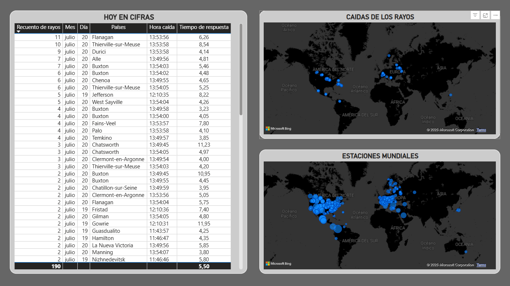
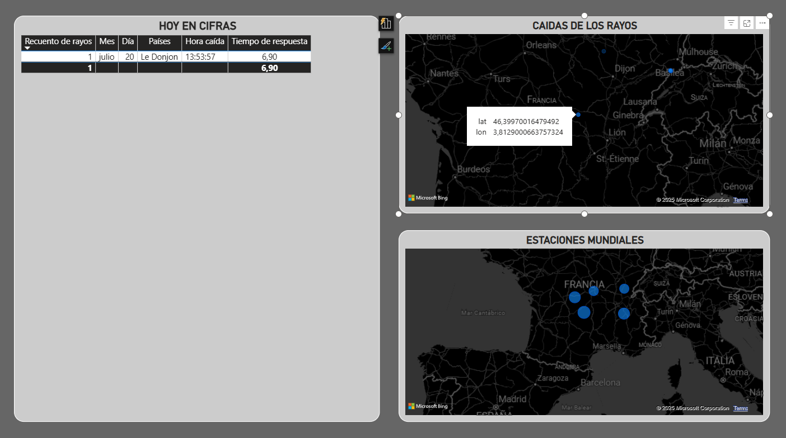
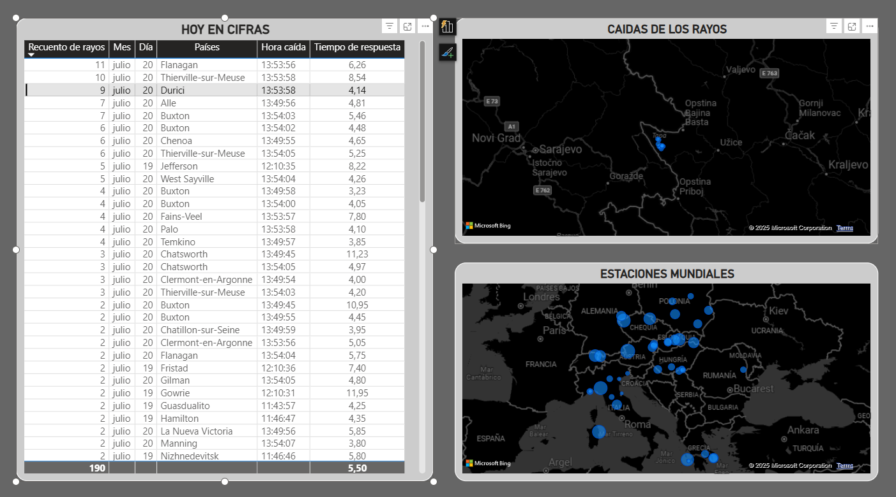

# ⚡ Strikewatch

Strikewatch es un proyecto de análisis y visualización de rayos en tiempo real utilizando datos obtenidos desde la red global de detección de tormentas de Blitzortung. El sistema captura eventos de rayos mediante WebSockets, procesa los datos automáticamente y los almacena en una base de datos MySQL para su posterior análisis y visualización en dashboards interactivos.

El objetivo del proyecto es construir una solución completa de ingeniería y análisis de datos en tiempo real, combinando ingestión de datos, procesos ETL, almacenamiento y Business Intelligence.

---

# Características

* Recepción de rayos en tiempo real mediante WebSocket.
* Geolocalización automática de los rayos.
* Limpieza y transformación de datos con Python.
* Almacenamiento estructurado en MySQL.
* Dashboard interactivo en Power BI.
* Visualización de actividad eléctrica mundial.

---

# Tecnologías utilizadas

## Lenguajes y herramientas

* Python
* MySQL
* Power BI
* Pandas
* Asyncio
* WebSockets
* aiohttp
* Docker
* Git

---

# Estructura del proyecto

```bash
Strikewatch/
│
├── images/              # Imagenes del dashboard
├── GuardarRayos.py      # Limpieza de datos y almacenado en Postgres
├── mysqlXampp.ipynb     # Limpieza y almacenado de datos en Notebook para lecturra más fácil
├── strikewatch.pbix     # Dashboard de Power Bi
└── README.md
```

---

# Flujo del proyecto

1. Conexión al WebSocket de Blitzortung.
2. Recepción de datos comprimidos.
3. Descompresión y limpieza de información.
4. Conversión de timestamps y geolocalización.
5. Inserción en MySQL.
6. Visualización y análisis en Power BI.

---

# Procesamiento de datos

El sistema realiza automáticamente:

* Descompresión de mensajes recibidos.
* Conversión de timestamps UNIX.
* Conversión horaria a Europa/Madrid.
* Obtención automática del país mediante coordenadas.
* Limpieza y estructuración de datos.
* Inserción de rayos y estaciones asociadas en MySQL.

El proyecto está desarrollado utilizando programación asíncrona con `asyncio` y `aiohttp` para soportar procesamiento en tiempo real.

---

# Variables analizadas

Entre los datos procesados se encuentran:

* Latitud y longitud.
* Altitud del rayo.
* Polaridad.
* Tiempo de detección.
* Región.
* Retraso de señal.
* País.
* Estaciones detectoras asociadas.

---

# 📸 Capturas

> Aquí puedes añadir imágenes del dashboard desde la carpeta `/images`.

```md





```

---


# Configuración de MySQL

Crear una base de datos llamada:

```sql
CREATE DATABASE rayos;
```

Después configura las credenciales de conexión dentro del script Python.

---

# Uso

Ejecuta el script principal:

```bash
python GuardarRayos.py
```

El sistema comenzará automáticamente a escuchar eventos de rayos y almacenarlos en MySQL.

---

# Dashboard

El proyecto incluye un dashboard desarrollado en Power BI donde se visualizan:

* Actividad eléctrica mundial.
* Distribución geográfica de rayos.
* Métricas de intensidad y frecuencia.

---

# Objetivos del proyecto

* Practicar ingeniería de datos en tiempo real.
* Trabajar con WebSockets y procesamiento asíncrono.
* Construir pipelines ETL reales.
* Mejorar habilidades de Business Intelligence.
* Crear un proyecto sólido para portfolio de Data Analytics y Data Engineering.
